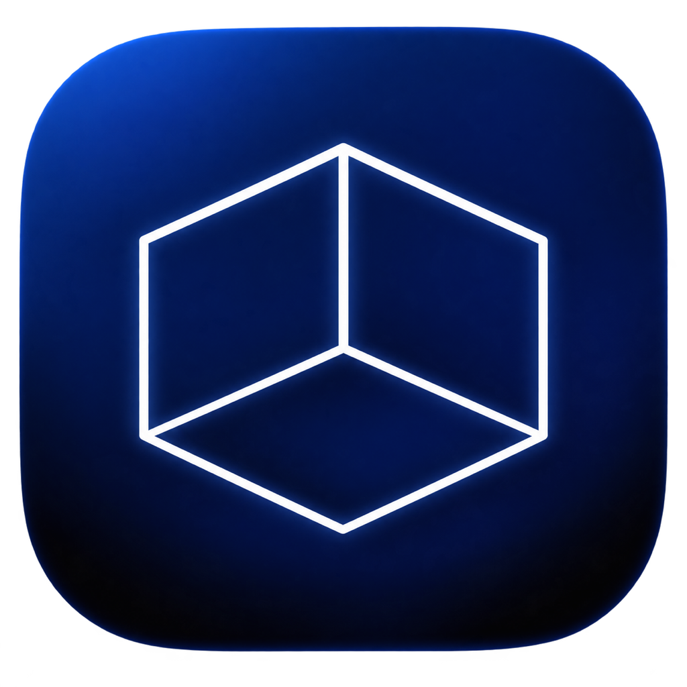
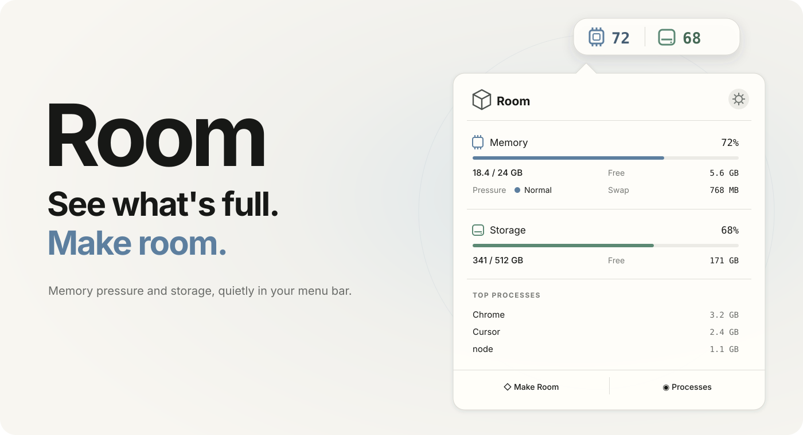

<p align="center">
  
</p>

<h1 align="center">Room</h1>

<p align="center"><strong>See what's full. Make room.</strong></p>

<p align="center">
  A quiet macOS menu bar app for memory pressure, storage, and safety-first cleanup.
</p>

<p align="center">
  <a href="https://www.apple.com/macos/"></a>
  <a href="https://www.swift.org/"></a>
  <a href="https://github.com/takeshita-0x0201/room/actions/workflows/ci.yml"></a>
  <a href="LICENSE"></a>
</p>

<p align="center">
  
</p>

## Install

```bash
brew install --cask takeshita-0x0201/tap/room
```

Already installed? Get the newest build with `brew upgrade --cask room`.

> [!NOTE]
> Current community builds are unsigned. If macOS blocks the first launch, open **System Settings → Privacy & Security → Open Anyway**, or run `xattr -dr com.apple.quarantine /Applications/Room.app` for a build you trust.

You can also download the universal `.zip` from [GitHub Releases](https://github.com/takeshita-0x0201/room/releases).

## One glance. That's the point.

| Memory | Storage | Make Room |
|:--|:--|:--|
| See usage and macOS **Memory Pressure** at a glance. High usage alone is not treated as a problem. | See boot-disk usage and Finder-compatible free space without opening a dashboard. | Review regenerable caches, logs, Trash, and developer files before anything is removed. |

Room stays deliberately small:

- Menu bar numbers for **Percentage**, **Free**, or **Used**
- Memory Pressure states: **Normal**, **Warning**, and **Critical**
- Top processes grouped by app, with protected Quit and Force Quit actions
- Cleanup for application, browser, and developer caches
- Universal support for Apple Silicon and Intel Macs

## Pressure, not panic

macOS is designed to use available RAM. A Mac at 90% memory can still be healthy, so Room does not behave like a “RAM cleaner.” It reads Memory Pressure and only suggests quitting high-memory apps when pressure is real.

```text
Memory Pressure Normal     → No action needed
Memory Pressure Warning    → Review high-memory apps
Memory Pressure Critical   → Review high-memory apps
```

Room never purges RAM, quits apps automatically, or promises artificial “memory recovered” numbers.

## Safety is the feature

```text
Scan regenerable data → Review every item → Confirm → Re-verify → Delete
```

- Every deletion goes through a Review screen with per-item controls.
- System-critical processes are protected and cannot be quit.
- Caches belonging to running apps are skipped.
- Paths, real paths, symlinks, inode, and device identity are checked again immediately before deletion.
- Monitoring works without permissions. Full Disk Access is only suggested if you choose to include Trash.
- Room has no analytics, telemetry, accounts, or network communication.

The complete behavior and threat model are documented in [docs/requirements.md](docs/requirements.md).

## Build from source

Requires Xcode 16 or later and [XcodeGen](https://github.com/yonaskolb/XcodeGen):

```bash
brew install xcodegen
xcodegen generate
xcodebuild -project Room.xcodeproj -scheme Room -destination 'platform=macOS' test
```

The generated `Room.xcodeproj` is not committed; [project.yml](project.yml) is the source of truth.

<details>
<summary><strong>How Room calculates its numbers</strong></summary>

### Memory

Memory Used follows Activity Monitor's model: App Memory (`internal − purgeable`) + Wired Memory + Compressed Memory. RAM values use base 1024.

### Storage

Free space uses APFS-aware `volumeAvailableCapacityForImportantUsage`, matching the capacity Finder considers available. Storage values use base 1000.

</details>

<details>
<summary><strong>What Room can clean</strong></summary>

- Application and supported browser caches
- Temporary files older than three days
- Logs older than seven days
- Trash, when Full Disk Access is granted
- Xcode DerivedData and Simulator caches
- npm, pnpm, Yarn, Homebrew, CocoaPods, and Gradle caches

Important user data is out of scope. A Review always comes first.

</details>

## Contributing

Contributions are welcome. Start with [CONTRIBUTING.md](CONTRIBUTING.md), then see the [requirements](docs/requirements.md), [design system](docs/design-system.md), and [extension guide](docs/extensions.md).

## License

Room is available under the [MIT License](LICENSE).
